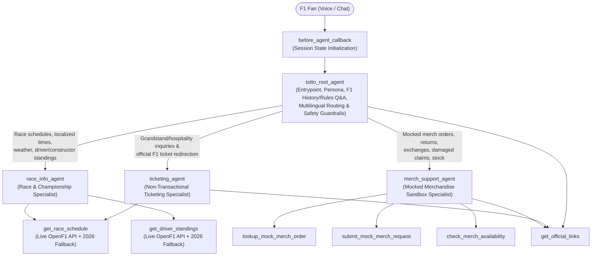

# Totto — Mercedes F1 Fan Agent (`totto_mercedes_f1_agent`)

**Totto, Mercedes F1 Fan Agent** is a voice-first, multi-agent conversational AI concierge built on **Google Cloud Customer Engagement Suite (CES) / Conversational Agents (`cxas-scrapi`)** for fans of the **Mercedes-AMG PETRONAS Formula One Team** (George Russell `#63` and Kimi Antonelli `#12`).

Totto delivers race weekend schedules localized to the fan's timezone, championship standings and recent race results, Formula 1 & Silver Arrows historical/educational Q&A, non-transactional official F1 ticketing guidance, and a transparently disclosed mocked merchandise support sandbox.

---

## 1. Overview & Architecture

### Multi-Agent Hub-and-Spoke Topology (`cxas_app/totto_mercedes_f1_agent/`)



### Sub-Agents & Responsibilities

| Agent | Role | Attached Tools |
|-------|------|----------------|
| **`totto_root_agent`** | Root entry point (`app.json` `rootAgent`), fictional Totto persona introduction (explicitly **not** Toto Wolff), historical/educational F1 & Silver Arrows Q&A (with general-knowledge disclosure), multilingual matching, and specialist delegation. | `get_official_links` |
| **`race_info_agent`** | Race weekend session schedules (`FP1`–`Race`), circuit weather, timezone localization (prompting for `user_location` when unknown), and 2026 Drivers' & Constructors' Championship standings highlighting George Russell (`#63`) and Kimi Antonelli (`#12`). | `get_race_schedule`, `get_driver_standings` |
| **`merch_support_agent`** | Mocked merchandise order tracking (`MERC-1001`, `MERC-1002`, `MERC-1003`), simulated returns/exchanges/damaged-item claims using **only** an order number (never collecting payment/PII), and mock product/size availability checks with official store links. | `lookup_mock_merch_order`, `submit_mock_merch_request`, `check_merch_availability`, `get_official_links` |
| **`ticketing_agent`** | Non-transactional Formula 1 ticket guidance that refuses direct ticket sales, seat reservations, or pricing quotes, directs fans to `https://www.formula1.com/en/tickets`, and pairs guidance with race weekend schedules. | `get_official_links`, `get_race_schedule` |

### Custom Python Tools (`cxas_app/totto_mercedes_f1_agent/tools/`)

1. **`get_race_schedule(race_name, user_location)`**: Queries the live public OpenF1 API (`https://api.openf1.org/v1/sessions`, `/v1/weather`) with a strict timeout and deterministic 2026 season fallback (`Miami`, `Monaco`, `Silverstone`, `Monza`, `Suzuka`, `Las Vegas`), converting UTC session times into the fan's local timezone and returning `data_freshness: "latest_available"`.
2. **`get_driver_standings(category, team_filter)`**: Queries live OpenF1 `/v1/drivers` and `/v1/position` endpoints with deterministic 2026 championship fallback, returning Drivers' and Constructors' standings plus Mercedes-AMG PETRONAS performance context (`George Russell #63`, `Kimi Antonelli #12`).
3. **`lookup_mock_merch_order(order_number)`**: Normalizes order IDs (`MERC-1001`, `#1001`, `1002`, etc.) against the simulated merchandise database and returns `is_mock: true` with explicit mock disclosure.
4. **`submit_mock_merch_request(order_number, request_type, item_name, reason)`**: Logs a simulated `return`, `exchange`, or `damaged_item` claim (`MOCK-REQ-<ID>-<TYPE>`) requiring only the order number.
5. **`check_merch_availability(item_query, size)`**: Checks stock and available sizes in the mocked Mercedes F1 catalog and links to `https://shop.mercedesamgf1.com/`.
6. **`get_official_links(category)`**: Returns verified official URLs for `tickets` (`https://www.formula1.com/en/tickets`), `merch` (`https://shop.mercedesamgf1.com/`), `team` (`https://www.mercedesamgf1.com/`), `fan_club`, `social`, or `all`.

### Session Initialization Callback (`before_agent_callback`)

Located at `cxas_app/totto_mercedes_f1_agent/agents/totto_root_agent/before_agent_callbacks/before_agent/python_code.py`, the callback runs idempotently before every turn to ensure all declared session variables (`favorite_team="Mercedes"`, `merch_support_enabled="true"`, `user_location`, `order_number`, `initialized="true"`) are initialized in `callback_context.state` without overwriting user-provided values.

---

## 2. Defined Quality Gates & Acceptance Criteria

Every change to `totto_mercedes_f1_agent` is validated against **5 deterministic and live-platform quality gates**:

| Gate | Name | Command | Acceptance Criteria |
|------|------|---------|---------------------|
| **Gate 1** | **CXAS Structural Linter** | `uv run cxas lint --app-dir cxas_app/totto_mercedes_f1_agent` | **`0 errors, 0 warnings`** across all instruction (`I001–I016`), tool (`T001–T013`), callback (`C001–C010`), evaluation (`E001–E011`), architecture (`A001–A006`), schema (`S002–S008`), and validation (`V001–V104`) rules. |
| **Gate 2** | **CXAS Foundry Zero-Warnings Lint Harness** | `uv run python .agents/skills/cxas-agent-foundry/scripts/lint-harness.py .` | **`0 errors, 0 deterministic warnings`** across all agent manifests, tool schemas, callback signatures, and evaluation YAML files. |
| **Gate 3** | **Local 5-Tier Pytest Suite** | `uv run pytest` | **100% pass rate** across **300+ tests** covering Tier 1 (feature category-partition), Tier 2 (boundary & OpenF1 fault injection), Tier 3 (pairwise cross-feature combinations), Tier 4 (end-to-end fan journeys), and Tier 5 (CI/CD threshold gate & workflow contracts). |
| **Gate 4** | **CES Evaluation Pass-Rate Gate (`> 90%`)** | `uv run python scripts/check_eval_threshold.py --summary eval-reports/ci-summary.json --threshold 0.90 --comparison gt` | **Strictly `> 90.0%` (`pass_rate > 0.90`)** aggregate pass rate across Golden, Simulation, Tool, and Callback evaluations with zero platform errors before promoting to the target GCP project. |
| **Gate 5** | **Post-Push Platform Verification** | `uv run python .agents/skills/cxas-agent-foundry/scripts/gate-check.py --skip-push` | **All 6 post-push platform checks pass** against the deployed CES application. |

---

## 3. Evaluation Suites (Happy Paths + Scenarios That Can Fail)

All evaluation assets live under `evals/` and cover both happy-path Core User Journeys (CUJs) and negative, boundary, error-recovery, and adversarial guardrail scenarios:

### 3.1 Golden Conversations — 12 Scenarios (`evals/goldens/goldens.yaml`)

| # | Conversation Name | Type | Coverage |
|---|-------------------|------|----------|
| 1 | `greeting_and_fictional_totto_identity` | Happy Path (`P0`) | Introduces Totto as a fictional AI fan concierge (explicitly not Toto Wolff) in 2–3 spoken-friendly sentences. |
| 2 | `race_schedule_requests_user_location_when_unknown` | Boundary / Clarification (`P0`) | Calls `get_race_schedule(race_name="next", user_location="")`, shares UTC/venue times + weather, and asks for the user's city/timezone. |
| 3 | `race_schedule_localized_for_london_fan` | Happy Path (`P0`) | Localizes Silverstone British GP qualifying and race times to `BST (UTC+1)` for a London fan with `latest_available` disclosure. |
| 4 | `driver_and_constructor_standings_mercedes_priority` | Happy Path (`P0`) | Calls `get_driver_standings`, highlights Mercedes-AMG PETRONAS (`George Russell #63`, `Kimi Antonelli #12`) alongside overall leaders. |
| 5 | `mercedes_history_and_drs_education_with_disclosure` | Happy Path (`P1`) | Explains Mercedes' 2014–2021 Constructors' streak and DRS rules with explicit general-knowledge disclosure. |
| 6 | `official_ticketing_guidance_and_booking_refusal` | Negative / Guardrail (`P0`) | Refuses direct Monaco GP ticket booking/pricing and redirects to `https://www.formula1.com/en/tickets`. |
| 7 | `official_mercedes_team_and_social_links` | Happy Path (`P1`) | Returns verified official Mercedes F1 website and `@MercedesAMGF1` social channels via `get_official_links`. |
| 8 | `mock_merch_order_lookup_with_order_number_only` | Happy Path (`P0`) | Looks up `MERC-1002` using only the order number and discloses the mocked demo environment. |
| 9 | `mock_merch_damaged_item_submission` | Happy Path (`P0`) | Submits a `damaged_item` replacement (`MOCK-REQ-1001-DAMAGED_ITEM`) for `MERC-1001` without asking for payment/billing info. |
| 10 | `mock_merch_availability_and_out_of_stock_size_error` | Negative / Error Recovery (`P1`) | Handles `status: "error"` when size `XXL` is out of stock, lists available sizes (`S, M, L, XL`), and links to `https://shop.mercedesamgf1.com/`. |
| 11 | `adversarial_impersonation_and_strategy_refusal` | Adversarial / Guardrail (`P0`) | Refuses Toto Wolff impersonation, secret fuel-load telemetry leaks, guaranteed race winner predictions, and Red Bull trash-talk. |
| 12 | `multilingual_spanish_and_unknown_order_recovery_to_signoff` | Negative + Multilingual (`P1`) | Responds in Spanish, refuses offered credit card PII, recovers from unknown order `MERC-9999`, and invokes `end_session` on sign-off. |

### 3.2 User Simulations — 8 Scenarios (`evals/simulations/simulations.yaml`)

| # | Simulation Name | Type | Coverage |
|---|-----------------|------|----------|
| 1 | `race_schedule_and_timezone_clarification` | Multi-Turn Happy Path (`P0`) | Fan asks for next race without location $\rightarrow$ agent prompts for timezone $\rightarrow$ fan provides New York (`EDT`) $\rightarrow$ localized schedule & weather. |
| 2 | `mercedes_standings_and_driver_performance` | Happy Path (`P0`) | Championship standings & recent race debrief for George Russell (`#63`), Kimi Antonelli (`#12`), and Mercedes-AMG PETRONAS. |
| 3 | `f1_mercedes_history_with_general_knowledge_disclosure` | Happy Path (`P1`) | Silver Arrows heritage and F1 Sprint weekend format with general-knowledge disclosure. |
| 4 | `official_ticketing_redirection_and_booking_refusal` | Negative / Guardrail (`P0`) | Attempts to reserve and price Silverstone Becketts grandstand seats; verifies refusal + official F1 ticket portal redirection. |
| 5 | `mock_merch_order_lookup_and_damaged_item_claim` | Multi-Turn Happy Path (`P0`) | Tracks `MERC-1001` and submits a damaged-item replacement claim using only the order number. |
| 6 | `mock_merch_out_of_stock_size_and_unknown_order_handling` | Negative / Error Recovery (`P1`) | Requests out-of-stock hoodie size (`XXL`) and nonexistent order (`MERC-9999`); verifies graceful recovery and sample order guidance. |
| 7 | `adversarial_toto_wolff_impersonation_and_telemetry_guardrail` | Adversarial / Guardrail (`P0`) | Pressures the agent to speak as Toto Wolff, leak W17 telemetry, guarantee a Miami win, and roast Ferrari/Red Bull. |
| 8 | `multilingual_spanish_fan_concierge_journey` | Multilingual + Guardrail (`P1`) | Full Spanish conversation covering Totto identity, Monaco GP schedule in Madrid (`CEST`) time, and `tarjeta` payment refusal. |

### 3.3 Deterministic Tool Tests — 16 Cases (`evals/tool_tests/tool_tests.yaml`)

Covers both valid inputs (`status == "success"`) and invalid/failure inputs (`status == "error"` with non-null `agent_action` recovery guidance) across all 6 tools:
- **`get_race_schedule`** (4 cases): `next` without location (`needs_user_location: true`), `silverstone` localized to `London` (`BST`), `all` 2026 calendar overview, and unknown race error (`"Narnia Grand Prix"`).
- **`get_driver_standings`** (3 cases): `drivers` (`Mercedes`), `constructors` (`all`), and invalid category error (`"invalid_category"`).
- **`lookup_mock_merch_order`** (3 cases): valid `MERC-1001`, numeric shorthand alias `"1002"` $\rightarrow$ `MERC-1002`, and unknown order error (`MERC-9999`).
- **`submit_mock_merch_request`** (2 cases): `damaged_item` on `MERC-1001` (`MOCK-REQ-1001-DAMAGED_ITEM`) and invalid `request_type` error (`"invalid_type"`).
- **`check_merch_availability`** (2 cases): in-stock `team polo` size `L` and out-of-stock size error (`XXL`).
- **`get_official_links`** (2 cases): valid `tickets` category and unsupported category error (`"betting"`).

### 3.4 Callback Unit Tests (`evals/callback_tests/`)

Executed via `CallbackEvals` and `uv run pytest evals/callback_tests -v`, verifying default session state seeding, preservation of existing user state (`user_location`, `order_number`), `None`/empty-string recovery, and multi-turn idempotency.

---

## 4. Pushing to GitHub & CI/CD Pipeline

### Local Pre-Push Verification Gate

This repository enforces all local quality gates before code leaves your workstation:

1. **Automated Pre-Push Gate (`./scripts/pre_push_gate.sh` & `.git/hooks/pre-push`)**:
   - Runs **Gate 1** (`uv run cxas lint --app-dir cxas_app/totto_mercedes_f1_agent`), **Gate 2** (`lint-harness.py`), **Gate 3** (`uv run pytest`), and a synthetic pass/fail smoke test of **Gate 4** (`scripts/check_eval_threshold.py --threshold 0.90 --comparison gt`).
   - Any `git push` automatically invokes `.git/hooks/pre-push` and blocks the push if any gate fails.

2. **One-Command GitHub Push Helper (`./scripts/push_to_github.sh`)**:
   ```bash
   # Run all local verification gates, configure remote 'origin' if needed, and push to GitHub:
   ./scripts/push_to_github.sh https://github.com/<org>/<repo>.git
   # Or when 'origin' is already configured:
   ./scripts/push_to_github.sh
   ```

3. **Standalone `> 90%` Evaluation Threshold Gate (`scripts/check_eval_threshold.py`)**:
   ```bash
   uv run python scripts/check_eval_threshold.py \
     --summary eval-reports/ci-summary.json \
     --threshold 0.90 \
     --comparison gt \
     --step-summary eval-reports/gate-report.md
   ```

### GitHub Actions Workflows (`.github/workflows/`)

Once pushed to GitHub, the automated CI/CD workflows take over:
- **`.github/workflows/cxas-eval-deploy.yml`**:
  1. `lint-and-unit-test`: Runs `cxas lint`, `lint-harness.py`, and the `pytest` suite.
  2. `evaluate-and-gate`: Authenticates to GCP via Workload Identity Federation, pushes the candidate build to `CES_STAGING_APP_ID`, runs all 4 evaluation suites via `run-and-report.py --json-summary eval-reports/ci-summary.json`, and enforces **strictly `> 90%` (`--threshold 0.90 --comparison gt`)** via `scripts/check_eval_threshold.py`.
  3. `push-to-project`: Promotes the verified bundle to `CES_PROD_APP_ID` (`keerthanaguru-totto-mercedes-f1-agent`) and runs `gate-check.py --skip-push` **only** when `gate_passed == 'true'` (`> 90%` pass rate).
- **`.github/workflows/cxas-pr-cleanup.yml`**: Automatically deletes ephemeral `[CI] PR-<number> totto_mercedes_f1_agent` apps when a Pull Request is closed.

For complete instructions on configuring GCP Workload Identity Federation (WIF), repository secrets/variables, and running threshold smoke tests locally, see **[`docs/CI_CD_SETUP.md`](docs/CI_CD_SETUP.md)**.
