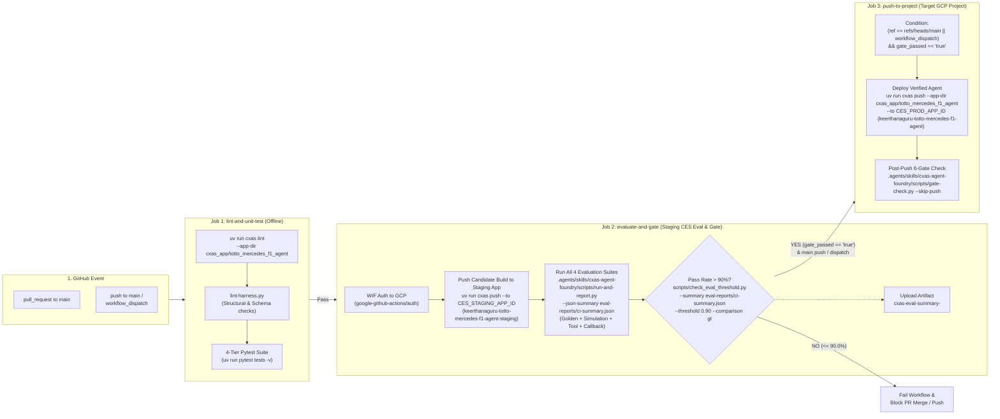

# CI/CD Pipeline & >90% Evaluation Gate Setup (`CI_CD_SETUP.md`)

## 1. Overview

This document explains the automated GitHub Actions CI/CD architecture for **Totto, Mercedes F1 Fan Agent** (`totto_mercedes_f1_agent`), how the **strict `> 90%` evaluation pass-rate gate** protects deployments in Google Cloud Customer Engagement Suite (CES), how to configure **GCP Workload Identity Federation (WIF)** variables and secrets, and how to verify the threshold gate and test suites locally before opening a Pull Request.

### Project Context (`gecx-config.json`)

| Key | Default Value | Description |
|-----|---------------|-------------|
| `gcp_project_id` / `project_id` | `gcp-ces-chirp-dev` | Target Google Cloud project hosting CES applications |
| `gcp_location` / `location` | `us-central1` | CES regional endpoint |
| `app_dir` | `cxas_app/totto_mercedes_f1_agent` | Local CXAS application bundle directory |
| `agent_name` | `totto_mercedes_f1_agent` | Root agent identifier |
| `app_display_name` | `keerthanaguru-totto-mercedes-f1-agent` | Default CES application display name |

---

## 2. Pipeline Architecture

The CI/CD system consists of two GitHub Actions workflows under `.github/workflows/`:

1. **`.github/workflows/cxas-eval-deploy.yml`**: A 3-job sequential pipeline (`lint-and-unit-test` $\rightarrow$ `evaluate-and-gate` $\rightarrow$ `push-to-project`) triggered on `push` to `main`, `pull_request` to `main`, and manual `workflow_dispatch` runs.
2. **`.github/workflows/cxas-pr-cleanup.yml`**: An automated cleanup workflow triggered when a Pull Request is `closed` (or via `workflow_dispatch`) that deletes any ephemeral `[CI] PR-<number> totto_mercedes_f1_agent` app from the CES project using `uv run cxas delete`.

### Pipeline Flowchart



### Job-by-Job Breakdown (`.github/workflows/cxas-eval-deploy.yml`)

1. **Job 1 — `lint-and-unit-test` (Stage 1: CXAS Lint & Local Unit Tests)**
   - Runs without GCP network dependencies to fail fast on syntax, schema, or unit regressions.
   - Executes `uv run cxas lint --app-dir cxas_app/totto_mercedes_f1_agent` (`I001–I016`, `T001–T013`, `C001–C010`, `E001–E011`, `A001–A006`, `S002–S008`, `V001–V007`, `V100–V104`).
   - Executes `.agents/skills/cxas-agent-foundry/scripts/lint-harness.py .` if present.
   - Executes the local 4-tier `pytest` suite (`uv run pytest tests -v`), covering unit, tool, callback, and schema tests.

2. **Job 2 — `evaluate-and-gate` (Stage 2: CES Evaluation Suite & `>90%` Pass-Rate Gate)**
   - Authenticates to Google Cloud via Workload Identity Federation (WIF).
   - Pushes the candidate agent bundle to the staging evaluation app (`CES_STAGING_APP_ID`, defaulting to `keerthanaguru-totto-mercedes-f1-agent-staging`):
     ```bash
     uv run cxas push \
       --app-dir cxas_app/totto_mercedes_f1_agent \
       --to "${CES_STAGING_APP_ID:-keerthanaguru-totto-mercedes-f1-agent-staging}" \
       --project-id "${GCP_PROJECT_ID}" \
       --location "${GCP_LOCATION}"
     ```
   - Runs `.agents/skills/cxas-agent-foundry/scripts/run-and-report.py` with `--json-summary eval-reports/ci-summary.json` across all four evaluation suites:
     - **Golden Evaluations** (`evals/goldens/goldens.yaml`)
     - **Simulation Evaluations** (`evals/simulations/simulations.yaml`)
     - **Tool Evaluations** (`evals/tool_tests/tool_tests.yaml`)
     - **Callback Evaluations** (`evals/callback_tests/test_callbacks.py`)
   - Enforces the strict `> 90%` (`> 0.90`) threshold gate via `scripts/check_eval_threshold.py`:
     ```bash
     uv run python scripts/check_eval_threshold.py \
       --summary eval-reports/ci-summary.json \
       --threshold 0.90 \
       --comparison gt
     ```
     By default, `--step-summary` writes the Markdown scorecard to `$GITHUB_STEP_SUMMARY` and `--github-output` exports `gate_passed=true|false` and `pass_rate=<pct>%` to `$GITHUB_OUTPUT`.
   - Uploads `eval-reports/ci-summary.json` as a workflow artifact (`cxas-eval-summary-<sha>`) in an `if: always()` step.

3. **Job 3 — `push-to-project` (Stage 3: Push Verified Agent to Target GCP Project)**
   - Runs **only** when `(github.ref == 'refs/heads/main' || github.event_name == 'workflow_dispatch') && needs.evaluate-and-gate.outputs.gate_passed == 'true'`.
   - Pushes the verified agent bundle to the production/target CES app (`inputs.target_app_id || vars.CES_PROD_APP_ID || 'keerthanaguru-totto-mercedes-f1-agent'`):
     ```bash
     uv run cxas push \
       --app-dir cxas_app/totto_mercedes_f1_agent \
       --to "${CES_PROD_APP_ID:-keerthanaguru-totto-mercedes-f1-agent}" \
       --project-id "${GCP_PROJECT_ID}" \
       --location "${GCP_LOCATION}"
     ```
   - Runs the post-push 6-gate verification check via:
     ```bash
     uv run python .agents/skills/cxas-agent-foundry/scripts/gate-check.py --skip-push
     ```

4. **PR Cleanup Workflow (`.github/workflows/cxas-pr-cleanup.yml`)**
   - Triggered on `pull_request: types: [closed]` or manual `workflow_dispatch` with `pr_number`.
   - Deletes any ephemeral `[CI] PR-<number> totto_mercedes_f1_agent` app from `GCP_PROJECT_ID`:
     ```bash
     uv run cxas delete \
       --display-name "[CI] PR-<number> totto_mercedes_f1_agent" \
       --project-id "${GCP_PROJECT_ID}" \
       --location "${GCP_LOCATION}"
     ```

---

## 3. Required GitHub Actions Variables & Secrets

Configure the following in your GitHub repository under **Settings $\rightarrow$ Secrets and variables $\rightarrow$ Actions**.

### Repository Variables (`vars.*`)

| Variable Name | Recommended / Default Value | Required | Description |
|---------------|-----------------------------|----------|-------------|
| `GCP_PROJECT_ID` | `gcp-ces-chirp-dev` | Yes | Target Google Cloud Project ID hosting CES applications (matches `gecx-config.json`). |
| `GCP_LOCATION` | `us-central1` | Yes | Target CES region (`us-central1` or `global`). |
| `CES_STAGING_APP_ID` | `keerthanaguru-totto-mercedes-f1-agent-staging` | Yes | Staging CES App ID or display name used in Stage 2 (`evaluate-and-gate`). |
| `CES_PROD_APP_ID` | `keerthanaguru-totto-mercedes-f1-agent` | Yes | Production/target CES App ID or display name used in Stage 3 (`push-to-project`). |
| `EVAL_THRESHOLD` | `0.90` | Optional | Minimum pass rate ratio required to pass the gate (strictly `> threshold`). |
| `EVAL_RUNS` | `5` | Optional | Number of evaluation trials per golden/simulation in Stage 2. |

### Repository Secrets (`secrets.*`)

| Secret Name | Example Format | Required | Description |
|-------------|----------------|----------|-------------|
| `GCP_WORKLOAD_IDENTITY_PROVIDER` | `projects/123456789012/locations/global/workloadIdentityPools/github-pool/providers/github-provider` | Yes | Full resource name of the GCP Workload Identity Provider for GitHub OIDC authentication. |
| `GCP_SERVICE_ACCOUNT` | `cxas-ci-deployer@gcp-ces-chirp-dev.iam.gserviceaccount.com` | Yes | GCP Service Account email impersonated by GitHub Actions runners. |

---

## 4. Configuring GCP Workload Identity Federation (WIF)

Use keyless OIDC authentication between GitHub Actions and Google Cloud (no long-lived JSON service account keys required):

```bash
export PROJECT_ID="gcp-ces-chirp-dev"
export PROJECT_NUMBER="$(gcloud projects describe "${PROJECT_ID}" --format='value(projectNumber)')"
export GITHUB_ORG="your-github-org"
export GITHUB_REPO="my_cxas_agent"
export SA_NAME="cxas-ci-deployer"
export SA_EMAIL="${SA_NAME}@${PROJECT_ID}.iam.gserviceaccount.com"

# 1. Create the CI Service Account
gcloud iam service-accounts create "${SA_NAME}" \
  --project="${PROJECT_ID}" \
  --display-name="CXAS CI/CD Evaluation & Deploy Service Account"

# 2. Grant required CES & Vertex AI roles for running evaluations and pushing apps
for ROLE in \
  "roles/ces.admin" \
  "roles/aiplatform.user" \
  "roles/storage.objectViewer"; do
  gcloud projects add-iam-policy-binding "${PROJECT_ID}" \
    --member="serviceAccount:${SA_EMAIL}" \
    --role="${ROLE}"
done

# 3. Create Workload Identity Pool & GitHub OIDC Provider (if not already created)
gcloud iam workload-identity-pools create "github-pool" \
  --project="${PROJECT_ID}" \
  --location="global" \
  --display-name="GitHub Actions Pool"

gcloud iam workload-identity-pools providers create-oidc "github-provider" \
  --project="${PROJECT_ID}" \
  --location="global" \
  --workload-identity-pool="github-pool" \
  --display-name="GitHub OIDC Provider" \
  --attribute-mapping="google.subject=assertion.sub,attribute.actor=assertion.actor,attribute.repository=assertion.repository,attribute.repository_owner=assertion.repository_owner" \
  --attribute-condition="assertion.repository_owner == '${GITHUB_ORG}'" \
  --issuer-uri="https://token.actions.githubusercontent.com"

# 4. Allow the GitHub repository to impersonate the Service Account
gcloud iam service-accounts add-iam-policy-binding "${SA_EMAIL}" \
  --project="${PROJECT_ID}" \
  --role="roles/iam.workloadIdentityUser" \
  --member="principalSet://iam.googleapis.com/projects/${PROJECT_NUMBER}/locations/global/workloadIdentityPools/github-pool/attribute.repository/${GITHUB_ORG}/${GITHUB_REPO}"
```

---

## 5. Local CLI Verification Commands

Before pushing a branch or opening a Pull Request, run the exact same checks locally from `/usr/local/google/home/keerthanaguru/my_cxas_agent`:

### 5.1 Run CXAS Linter (Zero Errors & Zero Warnings)

```bash
uv run cxas lint --app-dir cxas_app/totto_mercedes_f1_agent
uv run python .agents/skills/cxas-agent-foundry/scripts/lint-harness.py .
```

### 5.2 Run the Full Unit, Callback, Tool & 4-Tier Pytest Suite

```bash
# Run the complete pytest suite (including threshold gate & 4-tier tests)
uv run pytest tests -v

# Run callback evaluations specifically
uv run pytest evals/callback_tests -v
```

### 5.3 Test the `> 90%` Threshold Gate (`scripts/check_eval_threshold.py`) Locally

`scripts/check_eval_threshold.py` accepts the following CLI flags:
- `--summary`: Path to the JSON summary emitted by `run-and-report.py` (default: `eval-reports/ci-summary.json`).
- `--threshold`: Required pass rate ratio in `[0.0, 1.0]` (default: `0.90`).
- `--comparison`: Comparison operator, `gt` for strictly `>` threshold (default) or `ge` for `>=` threshold.
- `--step-summary`: Path to GitHub Actions step summary file (defaults to `$GITHUB_STEP_SUMMARY`).
- `--github-output`: Path to GitHub Actions output file (defaults to `$GITHUB_OUTPUT`).

You can test `scripts/check_eval_threshold.py` against an existing evaluation summary JSON or synthetic pass/fail fixtures matching the `run-and-report.py --json-summary` schema:

```bash
# 1. Verify against an existing or live evaluation JSON summary (strict > 90% check):
uv run python scripts/check_eval_threshold.py \
  --summary eval-reports/ci-summary.json \
  --threshold 0.90 \
  --comparison gt \
  --step-summary eval-reports/gate-summary.md \
  --github-output eval-reports/github-output.txt

# 2. Quick local smoke test of the threshold gate with a passing (> 90%) payload (exits 0):
python3 -c '
import json, pathlib, tempfile, subprocess, sys
with tempfile.TemporaryDirectory() as d:
    p = pathlib.Path(d) / "pass_summary.json"
    step_md = pathlib.Path(d) / "step_summary.md"
    gh_out = pathlib.Path(d) / "github_output.txt"
    p.write_text(json.dumps({
        "status": "complete",
        "total": 40,
        "passed": 39,
        "failed": 1,
        "pass_rate": 0.975,
        "by_type": {
            "golden": {"passed": 12, "failed": 0, "total": 12},
            "sim": {"passed": 8, "failed": 0, "total": 8},
            "tool_test": {"passed": 16, "failed": 0, "total": 16},
            "callback_test": {"passed": 3, "failed": 1, "total": 4}
        },
        "top_failures": [],
        "platform_errors": []
    }))
    res = subprocess.run([
        sys.executable, "scripts/check_eval_threshold.py",
        "--summary", str(p),
        "--threshold", "0.90",
        "--comparison", "gt",
        "--step-summary", str(step_md),
        "--github-output", str(gh_out)
    ])
    assert res.returncode == 0, f"Expected exit code 0, got {res.returncode}"
'

# 3. Quick local smoke test of the boundary condition (exactly 90.0% MUST FAIL under --comparison gt, exits 1):
python3 -c '
import json, pathlib, tempfile, subprocess, sys
with tempfile.TemporaryDirectory() as d:
    p = pathlib.Path(d) / "boundary_90_summary.json"
    p.write_text(json.dumps({
        "status": "complete",
        "total": 40,
        "passed": 36,
        "failed": 4,
        "pass_rate": 0.90,
        "by_type": {
            "golden": {"passed": 11, "failed": 1, "total": 12},
            "sim": {"passed": 7, "failed": 1, "total": 8},
            "tool_test": {"passed": 15, "failed": 1, "total": 16},
            "callback_test": {"passed": 3, "failed": 1, "total": 4}
        },
        "top_failures": [],
        "platform_errors": []
    }))
    res = subprocess.run([
        sys.executable, "scripts/check_eval_threshold.py",
        "--summary", str(p),
        "--threshold", "0.90",
        "--comparison", "gt"
    ])
    assert res.returncode == 1, f"Expected exit code 1 for 90.0% under strict gt, got {res.returncode}"
'
```

### 5.4 Run Live End-to-End Evaluation & Gate Scripts Locally (Requires GCP Auth)

When authenticated via `gcloud auth application-default login` with access to `gcp-ces-chirp-dev`:

```bash
# 1. Push candidate build to the staging evaluation app:
uv run cxas push \
  --app-dir cxas_app/totto_mercedes_f1_agent \
  --to keerthanaguru-totto-mercedes-f1-agent-staging \
  --project-id gcp-ces-chirp-dev \
  --location us-central1

# 2. Run full evaluation harness and emit JSON summary for the threshold gate:
uv run python .agents/skills/cxas-agent-foundry/scripts/run-and-report.py \
  --message "Local Eval" \
  --runs 5 \
  --priority P0,P1 \
  --json-summary eval-reports/ci-summary.json

# 3. Verify the > 90% threshold gate on the generated report:
uv run python scripts/check_eval_threshold.py \
  --summary eval-reports/ci-summary.json \
  --threshold 0.90 \
  --comparison gt \
  --step-summary eval-reports/gate-summary.md \
  --github-output eval-reports/github-output.txt

# 4. Push verified agent to production app and run post-push 6-gate check:
uv run cxas push \
  --app-dir cxas_app/totto_mercedes_f1_agent \
  --to keerthanaguru-totto-mercedes-f1-agent \
  --project-id gcp-ces-chirp-dev \
  --location us-central1
uv run python .agents/skills/cxas-agent-foundry/scripts/gate-check.py --skip-push
```
